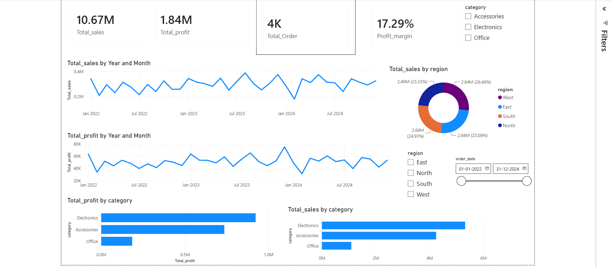
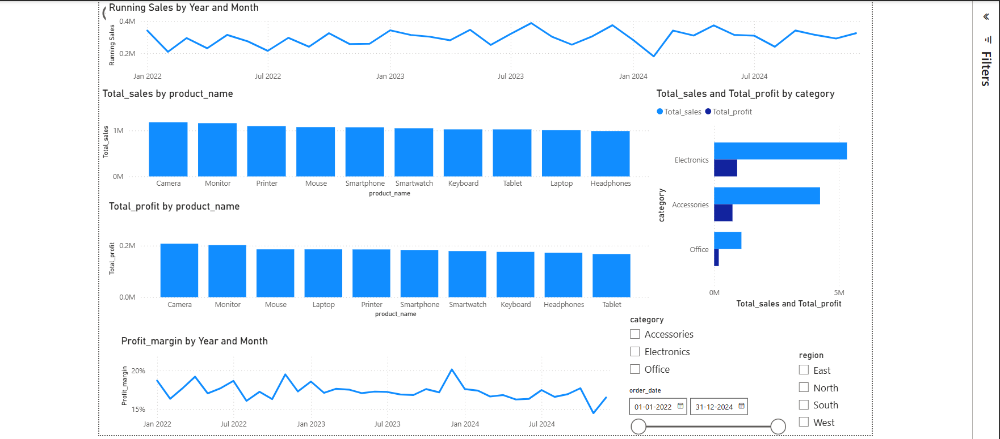
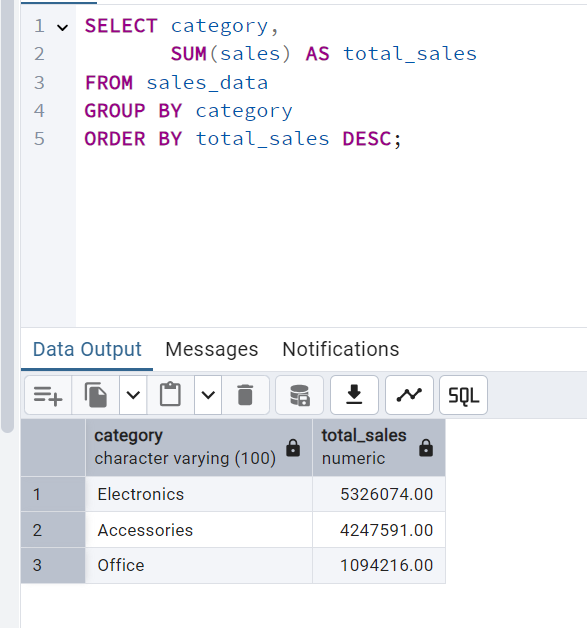
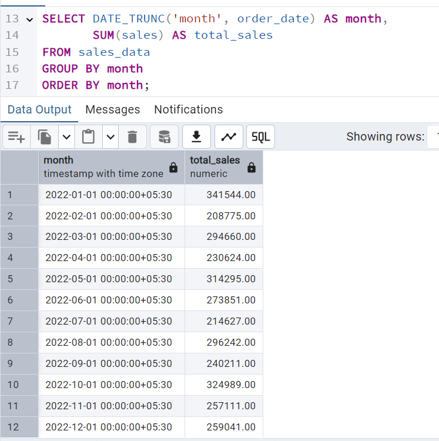
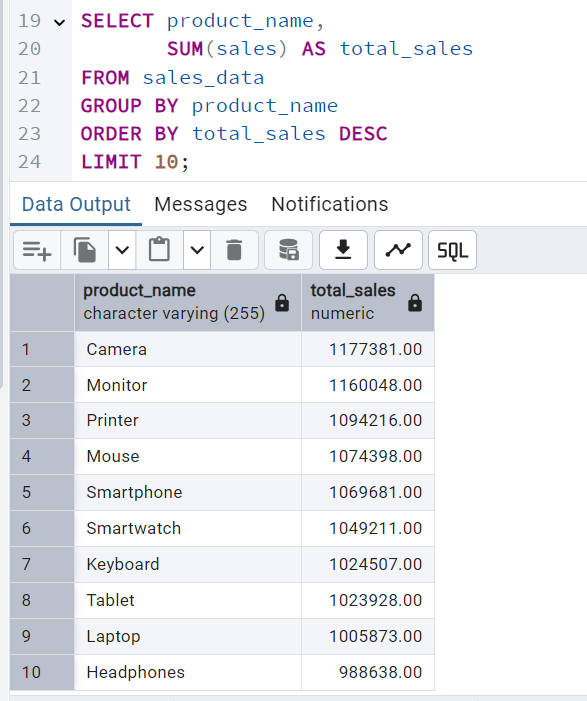

# Sales Performance Analysis & Dashboard

## Overview

This end-to-end Data Analytics project analyzes sales transaction data using **PostgreSQL (SQL)** and visualizes key business insights through an interactive **Power BI Dashboard**.

The project demonstrates the complete analytics workflow:

- Data Import & Preparation
- SQL-Based Business Analysis
- Advanced Querying with CTEs and Window Functions
- Data Modeling in Power BI
- Interactive Dashboard Development
- Business Insight Generation

---

## Tools & Technologies

- PostgreSQL
- SQL
- Power BI
- DAX
- Excel
- GitHub

---

##  Dataset

The dataset contains sales transactions with the following fields:

- Order Date
- Product Name
- Category
- Region
- Quantity
- Sales
- Profit

---

##  SQL Analysis

### Basic Analysis

- Total Sales
- Total Profit
- Total Orders
- Top Customers
- Top Products

### Intermediate Analysis

- Sales by Category
- Sales by Region
- Monthly Sales Trend
- Most Profitable Products
- Least Profitable Products

### Advanced Analysis

- Running Monthly Sales
- Profit Margin by Category

---

##  Power BI Dashboard

### Page 1: Executive Sales Overview

#### KPI Cards

- Total Sales
- Total Profit
- Total Orders
- Profit Margin %

#### Visualizations

- Monthly Sales Trend
- Monthly Profit Trend
- Sales by Region
- Sales by Category
- Profit by Category

#### Filters

- Category
- Region
- Date Range

---

### Page 2: Product Performance Analysis

#### Visualizations

- Top Products by Sales
- Top Products by Profit
- Sales vs Profit by Category
- Revenue Contribution by Category
- Profit Margin Trend

#### Filters

- Category
- Region
- Date Range

---

##  Dashboard Preview

### Executive Dashboard

> Add screenshot here



---

### Product Performance Dashboard

> Add screenshot here



---

##  SQL Analysis Outputs

### Sales by Category



### Monthly Sales Trend



### Top Products



---

## Key Business Insights

### 1. Electronics Category Leads Revenue

Electronics generated the highest sales and profit among all categories, making it the primary revenue driver.

### 2. Strong Product Concentration

A small group of products contributed a significant share of total revenue, highlighting key revenue-generating products.

### 3. Balanced Regional Performance

Sales distribution remained relatively balanced across all regions, reducing business dependency on a single market.

### 4. Consistent Profitability

Profit trends closely followed revenue trends, indicating stable profit margins throughout the analysis period.

### 5. Category Performance Gap

Office products generated considerably lower sales and profit compared to Electronics and Accessories.

### 6. Seasonal Sales Patterns

Monthly trend analysis revealed fluctuations in demand, indicating potential seasonal buying behavior.

---

## Repository Structure

```text
Sales-Performance-Analysis-SQL-PowerBI
│
├── Dataset
│   └── ecommerce_sales_data.xlsx
│
├── SQL Queries
│   └── Sales_analysis.sql
│
├── Power BI Dashboard
│   └── Sales_Performance_Dashboard.pbix
│
├── Screenshots
│   ├── Dashboard_Page1.png
│   ├── Dashboard_Page2.png
│   ├── Sales_By_Category.png
│   ├── Monthly_Sales_Trend.png
│   └── Top_Products.png
│
├── Insights.md
│
└── README.md
```

---

## 🎯 Skills Demonstrated

### SQL

- SELECT Statements
- Filtering & Sorting
- GROUP BY
- Aggregate Functions
- Common Table Expressions (CTEs)
- Window Functions
- Ranking Functions
- Running Totals

### Power BI

- Data Modeling
- DAX Measures
- KPI Cards
- Interactive Dashboards
- Slicers & Filters
- Trend Analysis
- Business Reporting

### Business Analysis

- Revenue Analysis
- Profitability Analysis
- Product Performance Analysis
- Regional Performance Analysis
- Trend Identification
- Insight Generation

---


